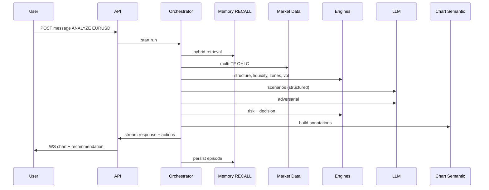

# Leovee — Agent Architecture

**Scope:** Layered AI trading analyst agent, orchestration, tools, state machines, and integration with deterministic engines.  
**Companion docs:** `ARCHITECTURE.md`, `MEMORY_ARCHITECTURE.md`, `DATABASE_SCHEMA.md`.

---

## 1. Design goals

1. Behave as a **research and analysis workspace**, not a signal bot.
2. **Never skip** deterministic validation (risk, data quality, adversarial checks).
3. **Never invent** market facts — tools supply evidence; LLM synthesizes.
4. Support **multiple chat modes** with one orchestrator and mode-specific prompt/tool budgets.
5. **Calibrated confidence** and **memory citations** in every serious recommendation.
6. **Event-driven** execution — no LLM on every price tick.

---

## 2. Layer model (15 layers)

| Layer | Name | Responsibility | Primary implementation |
|-------|------|----------------|------------------------|
| L1 | Data Layer | Fetch/normalize OHLC, spreads, snapshots | `MarketDataService`, OANDA provider |
| L2 | Market Intelligence | Regime: trend, range, momentum, exhaustion | `MarketIntelligenceEngine` |
| L3 | Technical Analysis | Indicators (server-side), MTF alignment | `TechnicalAnalysisService` |
| L4 | Fundamental / News | Calendar + news ranked evidence | `NewsEngine`, `ResearchService` |
| L5 | Research | Gap filling, contradiction detection | `ResearchAgent` |
| L6 | Reasoning | Evidence synthesis (LLM) | `ReasoningEngine` |
| L7 | Scenario Engine | Bull / bear / no-trade hypotheses | `ScenarioEngine` |
| L8 | Adversarial Validation | Attack scenarios | `DevilsAdvocateAgent` |
| L9 | Risk Engine | Stops, size, R:R, volatility adjust | `RiskEngine` (deterministic) |
| L10 | Decision Engine | BUY / SELL / WAIT / NO_TRADE | `DecisionEngine` |
| L11 | Recommendation Engine | Structured output + lifecycle | `RecommendationService` |
| L12 | Chart Intelligence | Semantic annotations | `ChartSemanticEngine` |
| L13 | Thesis Monitor | Ongoing validation | `ThesisMonitorEngine` + workers |
| L14 | Memory & Learning | RECALL, RECORD, LEARN | See `MEMORY_ARCHITECTURE.md` |
| L15 | Orchestration | Loop, routing, tracing | `AgentOrchestrator` |

Layers L2–L5, L9–L12 are predominantly **deterministic** or **tool-backed**. L5, L6, L8 use LLM with structured outputs.

---

## 3. Agent loop

```
PERCEIVE → RECALL → UNDERSTAND → RESEARCH → HYPOTHESIZE → CHALLENGE →
RISK CHECK → DECIDE → VISUALIZE → MONITOR → UPDATE → RECORD OUTCOME → LEARN
```

### 3.1 Phase definitions

| Phase | Inputs | Outputs | LLM? |
|-------|--------|---------|------|
| PERCEIVE | Symbol, TF set, events | Market snapshot, data quality flags | No |
| RECALL | Workspace, symbol, context | Memory bundle (labeled) | No (retrieval) |
| UNDERSTAND | Candles, engine outputs | Unified `MarketContext` | Optional FAST for summary |
| RESEARCH | Gaps, calendar, news | `ResearchReport` | RESEARCH model |
| HYPOTHESIZE | Context + research | `ScenarioSet` | REASONING model |
| CHALLENGE | Chosen scenario | Pass/fail + objections | REASONING model |
| RISK CHECK | Scenario levels, account prefs | `RiskAssessment` | No |
| DECIDE | Scenarios, risk, memory stats | `Decision` | REASONING (bounded) |
| VISUALIZE | Decision + evidence | `ChartSemanticModel` | Optional for label text |
| MONITOR | Active thesis | State transitions | Event-driven |
| UPDATE | New events | Revised recommendation | Selective |
| RECORD OUTCOME | Terminal state | `OutcomeRecord` | No |
| LEARN | Outcome | Stats, lessons, calibration | MemoryWriter (propose) |

### 3.2 Triggers

| Trigger | Typical path |
|---------|----------------|
| User message ("Analyze EURUSD") | Full loop through VISUALIZE; may skip MONITOR |
| `STRUCTURE_SHIFT`, `LIQUIDITY_SWEEP` | MONITOR → UPDATE for active theses |
| `NEWS_EVENT` (high impact) | RESEARCH → UPDATE |
| Scheduled thesis tick | MONITOR only |
| Terminal thesis | RECORD → LEARN |

**Cost rule:** If `PERCEIVE` finds no meaningful change and no user question → **no LLM call**.

---

## 4. Orchestrator

### 4.1 `AgentOrchestrator`

- Entry: `run(request: AgentRunRequest) -> AgentRunResult`
- Creates `agent_runs` row + trace stream.
- Builds **execution graph** from `ChatMode` + trigger type.
- Enforces **timeouts** per phase and **token budgets** per category (chat vs memory vs evidence).
- Routes models via `ModelRouter` (task type → provider/model).
- Emits domain events (`ANALYSIS_COMPLETED`, `RECOMMENDATION_CREATED`, …).

### 4.2 Chat modes

| Mode | Graph emphasis |
|------|----------------|
| CHAT | Light PERCEIVE, RECALL, conversational REASONING |
| ANALYZE | Full loop through VISUALIZE |
| RESEARCH | RESEARCH-heavy, may skip DECIDE |
| CHART | VISUALIZE + chart tools |
| TRADE_SETUP | HYPOTHESIZE → RISK → DECIDE |
| EXPLAIN | Read-only tools + reasoning on existing analysis |
| REVIEW | RECALL + past episodes |
| RECALL | Memory tools only + narrative |

Mode stored on `conversations.mode` and overridable per message.

---

## 5. Specialized agents

### 5.1 `ResearchAgent`

Responsibilities (spec §27):

1. Identify missing information vs current thesis/context.
2. Query `NewsProvider` / `EconomicCalendarProvider`.
3. Compare sources; detect contradictions.
4. Rank evidence with provenance.
5. Return structured `ResearchReport` — primary question: *what could invalidate the thesis?*

### 5.2 `DevilsAdvocateAgent`

- Input: leading scenario + full `MarketContext` + RECALL lessons.
- Checks: opposing TF, liquidity, news, spread, volatility, R:R, overextension, false breakout patterns, **lesson memory** for similar failures.
- Output: `AdversarialReport { passed: bool, objections: [], severity }`
- **Hard fail** → decision capped at WAIT / NO_TRADE.

### 5.3 `MemoryWriter` (LLM-assisted)

- Runs post-outcome and optionally after major invalidations.
- Proposes **lesson** candidates and semantic updates — persisted only after schema validation.
- Cannot write episodes or outcomes (deterministic services only).

### 5.4 Thesis monitor (L13)

- Worker batches active theses per symbol.
- Re-runs deterministic checks (structure, volatility, spread, calendar).
- LLM only when deterministic flags `REASON_REQUIRED` (e.g. complex news synthesis).

---

## 6. Deterministic engines (summary)

### 6.1 Multi-timeframe engine

Default stacks:

- **HTF:** D1, H4  
- **MTF:** H1, M30, M15  
- **LTF:** M5, M1  

Pipeline: **HTF bias → MTF structure → LTF setup → entry trigger** (configurable per workspace).

### 6.2 Market structure engine

Events: HH, HL, LH, LL, BOS, CHOCH, MSS, swings, displacement, breakout, retest.  
Each event: `price`, `ts`, `timeframe`, `strength`, `confidence`, `evidence`, `invalidation`.

### 6.3 Liquidity engine

Equal highs/lows, PDH/PDL, PWH/PWL, session H/L, sweep vs target distinction (sweep ≠ auto reversal).

### 6.4 Supply / demand engine

Zones with decay: `upper`, `lower`, `freshness`, `mitigation`, `reaction_count`, confidence.

### 6.5 Volatility engine

Buckets: LOW, NORMAL, HIGH, EXTREME — ATR, percentile, spread, session.

### 6.6 Scenario engine

Always: **Scenario A BULLISH**, **B BEARISH**, **C NO_TRADE**; optional BREAKOUT / FALSE_BREAKOUT.  
Fields: evidence, contradictions, trigger, invalidation, targets, confidence (raw → calibrated at recommendation).

### 6.7 Risk engine

Deterministic: stop distance, position size, pip value, spread impact, vol-adjusted stop, portfolio caps.

### 6.8 Decision engine

Allowed: BUY, SELL, WAIT, NO_TRADE.  
Consults: adversarial pass, data quality, calibrated confidence, **strategy decay flags** (suspended strategies cannot reach READY).

### 6.9 Chart semantic engine

Builds `ChartSemanticModel` from evidence — selective annotations (spec §45). Validates geometry (time/price only).

---

## 7. Tool system

Tools are registered with JSON schema; exposed to LLM via unified tool-calling interface.

### 7.1 Market tools

- `get_market_snapshot(symbol)`
- `get_ohlc(symbol, timeframe, limit, end_ts?)`
- `get_multi_timeframe_data(symbol, timeframes[])`
- `detect_market_structure(symbol, timeframe)`
- `detect_liquidity(symbol, timeframe)`
- `detect_zones(symbol, timeframe)`
- `calculate_volatility(symbol, timeframe)`
- `get_session_context(symbol, ts?)`

### 7.2 Research tools

- `search_news(symbol | currency, query?)`
- `search_economic_calendar(currencies[], from, to)`

### 7.3 Risk tools

- `calculate_risk(setup)`
- `calculate_position_size(account, risk_pct, stop_pips)`

### 7.4 Thesis tools

- `get_previous_thesis(symbol)`
- `validate_thesis(thesis_id)`

### 7.5 Chart tools

- `create_chart_annotation(semantic_op)` — returns validated op id, persists to DB

### 7.6 Workspace tools

- `get_workspace_context()`

### 7.7 Memory tools (read + propose)

- `memory.search(query, filters)`
- `memory.get_symbol_profile(symbol)`
- `memory.get_strategy_stats(filters)`
- `memory.get_lessons(symbol?, setup?)`
- `memory.get_similar_episodes(embedding_query)`
- `memory.propose_lesson(structured)` — **propose only**

**Guardrail:** No tool exposes raw SQL, secrets, or KLineChart APIs.

---

## 8. LLM integration

### 8.1 `LLMProvider` interface

```python
class LLMProvider(Protocol):
    async def generate(self, request: GenerateRequest) -> GenerateResponse: ...
    async def stream(self, request: GenerateRequest) -> AsyncIterator[StreamChunk]: ...
    async def tool_call(self, request: ToolCallRequest) -> ToolCallResponse: ...
    async def structured_output(self, request: StructuredRequest) -> BaseModel: ...
```

Implementations: `AnthropicProvider`, `OpenAIProvider`.

### 8.2 `ModelRouter`

| Task type | Default route | Fallback |
|-----------|---------------|----------|
| FAST_MODEL | OpenAI fast | Anthropic haiku-class |
| REASONING_MODEL | Anthropic sonnet/opus-class | OpenAI reasoning |
| RESEARCH_MODEL | Configurable | Secondary provider |
| EMBEDDING | OpenAI / dedicated | — |

Model IDs stored in `model_configs` — **not** hard-coded in business logic.

### 8.3 Structured outputs

Pydantic models for: `ScenarioSet`, `AdversarialReport`, `ResearchReport`, `ChartSemanticModel`, `LessonProposal`.

---

## 9. State machines

### 9.1 Trade setup (spec §37)

`WATCH → SETUP_FORMING → WAITING_CONFIRMATION → READY → ACTIVE → WEAKENING → INVALIDATED | TARGET_REACHED | EXPIRED | NO_TRADE`

### 9.2 Recommendation lifecycle (spec §109)

`DETECTED → ANALYZING → FORMING → WAITING_CONFIRMATION → READY → ACTIVE → STRENGTHENING | WEAKENING → terminal`

Terminal → `OUTCOME_RECORDED` event → learning pipeline.

### 9.3 Thesis (spec §40)

`ACTIVE → STRENGTHENING | WEAKENING → INVALIDATED | TARGET_REACHED | EXPIRED`

---

## 10. Context management (chat)

Layers of context assembled for each LLM call:

1. **System policy** — no hallucination, uncertainty, tool mandate.
2. **Mode instructions** — ANALYZE vs CHAT, etc.
3. **Workspace preferences** — from user/workspace memory.
4. **RECALL bundle** — episodes, lessons, stats (labeled **HISTORICAL MEMORY**).
5. **Live market context** — tool outputs, snapshots (labeled **LIVE DATA**).
6. **Active thesis / recommendation** — if any.
7. **Recent messages** — last N turns.
8. **Summarized history** — `conversations.summary_text` for older turns.

Token budget allocator drops lowest-priority sections first (never drop live data validation flags).

---

## 11. Chat actions (frontend contract)

Assistant messages may include validated `actions[]`:

| Action | Effect |
|--------|--------|
| OPEN_CHART | Navigate chart panel |
| SET_SYMBOL | Chart + context |
| SET_TIMEFRAME | TF manager |
| DRAW_ANNOTATION | Apply semantic ops |
| SHOW_RECOMMENDATION | Panel |
| SHOW_RESEARCH | Panel |
| SHOW_THESIS | Panel |
| SHOW_MEMORY | Panel |

Parsed server-side; client executes via application event bus — **no arbitrary code**.

---

## 12. Reasoning guardrails (spec §87)

| Condition | Response code |
|-----------|----------------|
| Missing OHLC | DATA_UNAVAILABLE |
| Thin evidence | INSUFFICIENT_EVIDENCE |
| n < threshold | LOW_SAMPLE on memory-driven claims |
| Abnormal spread | WAIT bias |
| Conflicting HTF/MTF | WAIT or NO_TRADE |

---

## 13. Agent tracing & privacy

- `agent_traces` store: tool name, redacted inputs/outputs, memory IDs retrieved, state transitions, evidence hashes.
- **Do not store** raw chain-of-thought or hidden reasoning blocks.
- User-facing explanations use `rationale`, `evidence`, `contradictions`, `uncertainty`, `memory_citations`.

---

## 14. Replay / backtest isolation

When `source=REPLAY`:

- Data access capped at `replay_ts` (candles, news, calendar).
- RECALL retrieves only episodes/lessons with `occurred_at <= replay_ts`.
- Outcomes tagged REPLAY; statistics separate from LIVE.

---

## 15. Testing strategy (agent)

| Area | Test type |
|------|-----------|
| State machines | Unit — illegal transitions rejected |
| Risk engine | Unit — golden cases |
| Adversarial fail | Integration — forces NO_TRADE |
| Tool-only prices | Integration — LLM cannot change OHLC |
| Replay leakage | Integration — future candle query returns empty |
| End-to-end analyze | Integration — mock OANDA + snapshot LLM |

---

## 16. Sequence: "Analyze EURUSD" (reference)


