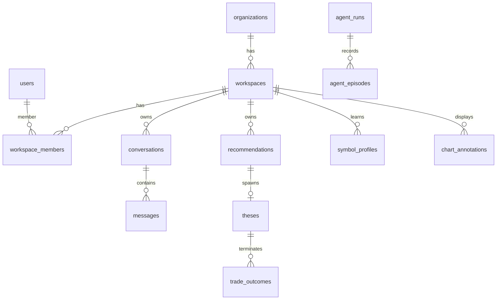

# Leovee — Database Schema

**Engine:** PostgreSQL 16+ with extensions `pgvector`, `uuid-ossp` (or built-in `gen_random_uuid()`), `citext` (optional for email)  
**Conventions:** `timestamptz` UTC, `uuid` primary keys, `created_at` / `updated_at` on mutable tables, soft-delete via `deleted_at` where noted.

---

## 1. Multi-tenancy model

```
platform
  └── organization (tenant) ── tenant_id
        └── workspace ── workspace_id
              └── user membership (workspace_members)
```

- **`tenant_id`**: organization scope (billing, subscription, org admins).
- **`workspace_id`**: primary isolation boundary for trading data, chat, memory, charts.
- Every tenant-owned row includes `tenant_id`; workspace-owned rows include `workspace_id` (and `tenant_id` for join efficiency).

### 1.1 Row Level Security (RLS)

Enable RLS on: `conversations`, `messages`, `agent_episodes`, `agent_memories`, `memory_embeddings`, `lessons`, `symbol_profiles`, `strategy_stats`, `chart_annotations`, `oanda_connections`, `api_keys`, `journal_entries`, `trades`, `recommendations`, `theses`.

Session setup per request:

```sql
SET LOCAL app.tenant_id = '<uuid>';
SET LOCAL app.workspace_id = '<uuid>';
SET LOCAL app.user_id = '<uuid>';
```

Policies enforce `tenant_id` / `workspace_id` match session variables. Application layer still filters — RLS is defense in depth.

---

## 2. Identity & access

### 2.1 `organizations`

| Column | Type | Notes |
|--------|------|--------|
| id | uuid PK | tenant_id in app layer |
| name | text | |
| slug | citext unique | URL-safe |
| status | enum | ACTIVE, SUSPENDED |
| created_at | timestamptz | |
| updated_at | timestamptz | |

### 2.2 `users`

| Column | Type | Notes |
|--------|------|--------|
| id | uuid PK | |
| email | citext unique | |
| password_hash | text nullable | OAuth-only users null |
| email_verified_at | timestamptz | |
| status | enum | ACTIVE, SUSPENDED, PENDING_VERIFICATION |
| mfa_secret_enc | bytea nullable | encrypted |
| mfa_enabled | boolean | default false |
| last_login_at | timestamptz | |
| created_at, updated_at | timestamptz | |

### 2.3 `organization_members`

| Column | Type | Notes |
|--------|------|--------|
| id | uuid PK | |
| tenant_id | uuid FK organizations | |
| user_id | uuid FK users | |
| role | enum | ORG_OWNER, ORG_ADMIN, ORG_MEMBER |
| created_at | timestamptz | |

Unique `(tenant_id, user_id)`.

### 2.4 `workspaces`

| Column | Type | Notes |
|--------|------|--------|
| id | uuid PK | |
| tenant_id | uuid FK | |
| name | text | |
| slug | text | unique per tenant |
| owner_user_id | uuid FK users | |
| settings_json | jsonb | risk defaults, AI prefs, chart prefs |
| status | enum | ACTIVE, ARCHIVED |
| created_at, updated_at | timestamptz | |

### 2.5 `workspace_members`

| Column | Type | Notes |
|--------|------|--------|
| id | uuid PK | |
| tenant_id | uuid FK | |
| workspace_id | uuid FK | |
| user_id | uuid FK | |
| role_id | uuid FK roles | RBAC role binding |
| created_at | timestamptz | |

Unique `(workspace_id, user_id)`.

### 2.6 `roles` / `permissions` / `role_permissions`

**`roles`:** `id`, `code` (SUPER_ADMIN, ADMIN, SUPPORT, ANALYST, USER), `scope` (PLATFORM, TENANT, WORKSPACE), `tenant_id` nullable (platform roles null).

**`permissions`:** `id`, `code` (e.g. `workspace.read`, `memory.manage`, `admin.audit.read`).

**`role_permissions`:** `(role_id, permission_id)` PK.

Platform SUPER_ADMIN bypasses workspace RLS via separate admin connection role (audited).

### 2.7 `sessions`

| Column | Type | Notes |
|--------|------|--------|
| id | uuid PK | |
| user_id | uuid FK | |
| refresh_token_hash | text | |
| user_agent | text | |
| ip_address | inet | |
| expires_at | timestamptz | |
| revoked_at | timestamptz nullable | |
| created_at | timestamptz | |

Index `(user_id, revoked_at)`.

### 2.8 `oauth_accounts`

| Column | Type | Notes |
|--------|------|--------|
| id | uuid PK | |
| user_id | uuid FK | |
| provider | text | |
| provider_subject | text | |
| tokens_enc | bytea | encrypted |
| created_at | timestamptz | |

Unique `(provider, provider_subject)`.

### 2.9 `api_keys`

| Column | Type | Notes |
|--------|------|--------|
| id | uuid PK | |
| tenant_id, workspace_id | uuid FK | |
| user_id | uuid FK creator | |
| name | text | |
| key_prefix | text | display only |
| key_hash | text | |
| scopes | text[] | |
| expires_at | timestamptz nullable | |
| revoked_at | timestamptz | |
| last_used_at | timestamptz | |
| created_at | timestamptz | |

---

## 3. Billing & usage

### 3.1 `plans`

`id`, `code` (FREE, PRO, PRO_PLUS, ENTERPRISE), `name`, `limits_json` (messages, analyses, MCP calls, memory depth, …), `features_json`, `is_active`, `created_at`.

### 3.2 `subscriptions`

| Column | Type | Notes |
|--------|------|--------|
| id | uuid PK | |
| tenant_id | uuid FK | |
| plan_id | uuid FK | |
| status | enum | ACTIVE, PAST_DUE, CANCELED, TRIALING |
| payment_provider | text | stripe, manual |
| external_subscription_id | text nullable | |
| current_period_start/end | timestamptz | |
| created_at, updated_at | timestamptz | |

### 3.3 `invoices`

`id`, `tenant_id`, `subscription_id`, `amount_cents`, `currency`, `status`, `provider_invoice_id`, `issued_at`, `paid_at`, `metadata_json`.

### 3.4 `usage_records`

| Column | Type | Notes |
|--------|------|--------|
| id | uuid PK | |
| tenant_id, workspace_id | uuid | |
| metric | text | tokens, analysis_runs, mcp_calls, … |
| quantity | numeric | |
| period_start, period_end | timestamptz | |
| metadata_json | jsonb | model, provider |
| created_at | timestamptz | |

Index `(tenant_id, metric, period_start)`.

---

## 4. Chat & conversations

### 4.1 `conversations`

| Column | Type | Notes |
|--------|------|--------|
| id | uuid PK | |
| tenant_id, workspace_id | uuid | |
| user_id | uuid FK | creator |
| title | text | |
| symbol | text nullable | |
| mode | enum | CHAT, ANALYZE, … |
| status | enum | ACTIVE, ARCHIVED |
| pinned | boolean | |
| last_message_at | timestamptz | |
| summary_text | text nullable | rolling summary |
| summary_updated_at | timestamptz | |
| created_at, updated_at | timestamptz | |

Index `(workspace_id, last_message_at DESC)`.

### 4.2 `messages`

| Column | Type | Notes |
|--------|------|--------|
| id | uuid PK | |
| tenant_id, workspace_id | uuid | |
| conversation_id | uuid FK | |
| role | enum | user, assistant, system, tool |
| content | text | |
| content_json | jsonb nullable | structured blocks |
| symbol_context | text nullable | |
| chart_context_json | jsonb nullable | |
| model | text nullable | |
| provider | text nullable | |
| token_usage_json | jsonb | |
| latency_ms | int nullable | |
| created_at | timestamptz | |

Index `(conversation_id, created_at)`.

### 4.3 `message_tool_calls` / `message_attachments`

Tool calls: `message_id`, `tool_call_id`, `name`, `arguments_json`, `result_json`, `status`, `created_at`.

Attachments: `message_id`, `type`, `storage_key`, `metadata_json`.

---

## 5. Market reference data

### 5.1 `symbols`

`id`, `code` (EURUSD), `base_currency`, `quote_currency`, `asset_class`, `pip_location`, `is_active`, `provider_mappings_json`.

### 5.2 `watchlists` / `watchlist_items`

Watchlist: `id`, `tenant_id`, `workspace_id`, `name`, `sort_order`.  
Items: `watchlist_id`, `symbol_id`, `sort_order`.

---

## 6. Market data (global + workspace overlays)

### 6.1 `candles` (partitioned)

**Partition strategy:** LIST by `(symbol_id, timeframe)` or HASH on `symbol_id` with sub-partitions per timeframe — chosen per volume study; default **composite partition key** `(symbol_id, timeframe)`.

| Column | Type | Notes |
|--------|------|--------|
| symbol_id | uuid FK | |
| timeframe | enum | M1, M5, M15, M30, H1, H4, D1 |
| ts | timestamptz | candle open time UTC |
| open, high, low, close | numeric(18,8) | |
| volume | numeric nullable | |
| complete | boolean | |
| source | text | oanda |
| ingested_at | timestamptz | |

**PK:** `(symbol_id, timeframe, ts)`  
**Indexes:** BRIN or B-tree on `ts` per partition.

**Retention (configurable defaults):** M1 ≥ 1y; M5/M15/M30 ≥ 3y; H1/H4/D1 full history.

### 6.2 `market_snapshots`

Workspace-scoped or global cache pointers: `id`, `symbol_id`, `bid`, `ask`, `spread`, `mid`, `ts`, `metadata_json`.

### 6.3 `market_events`

Deterministic engine outputs: `id`, `symbol_id`, `timeframe`, `event_type`, `ts`, `price`, `strength`, `confidence`, `evidence_json`, `invalidation_json`, `created_at`.

### 6.4 `structures` / `liquidity_events` / `price_zones` / `volatility_states`

Normalized engine artifacts with `symbol_id`, `timeframe`, time range, geometry JSON (price levels), confidence, provenance.

---

## 7. News & research

### 7.1 `news_events` (shared global reference data — intentional)

`id`, `source`, `published_at`, `headline`, `summary`, `currency`, `relevance`, `market_impact`, `url`, `external_id`, `raw_json`, `ingested_at`.  
Unique `(source, external_id)`.

**Tenant scoping decision:** `news_events` is **deliberately shared global reference data**, not workspace-scoped. It has **no** `tenant_id` / `workspace_id` columns and **no** RLS policy.

Rationale: rows are upserted from public market/news providers (Finnhub headlines / calendar-style fields) keyed by `(source, external_id)`. Nothing user-specific, conversation-specific, or workspace-specific is written into this table. Per-workspace copies would only duplicate the same public feed.

Isolation boundary: user-authored research stays in `research_items` (workspace-owned + RLS). Do **not** store private notes, prompts, or PII in `news_events`.

### 7.2 `research_items`

`id`, `tenant_id`, `workspace_id`, `symbol_id` nullable, `query`, `items_json`, `contradictions_json`, `created_at`, `agent_run_id` nullable.

---

## 8. Agent execution

### 8.1 `agent_runs`

| Column | Type | Notes |
|--------|------|--------|
| id | uuid PK | |
| tenant_id, workspace_id | uuid | |
| user_id | uuid nullable | |
| conversation_id | uuid nullable | |
| symbol | text | |
| trigger | text | user_message, event, scheduled |
| state | text | |
| status | enum | RUNNING, COMPLETED, FAILED |
| decision | text nullable | |
| model, provider | text | |
| tool_calls_count | int | |
| memories_retrieved_count | int | |
| started_at, completed_at | timestamptz | |
| error | text nullable | |

### 8.2 `agent_traces`

`id`, `agent_run_id`, `seq`, `event_type`, `payload_json` (tool I/O, evidence refs — **no CoT**), `created_at`.

### 8.3 `scenarios`

`id`, `agent_run_id`, `label` (BULLISH, BEARISH, NO_TRADE, …), `evidence_json`, `confidence_raw`, `confidence_calibrated`, `invalidation_json`, `targets_json`.

---

## 9. Recommendations, theses, trades

### 9.1 `recommendations`

| Column | Type | Notes |
|--------|------|--------|
| id | uuid PK | |
| tenant_id, workspace_id | uuid | |
| symbol_id | uuid | |
| direction | enum | BUY, SELL, WAIT, NO_TRADE |
| status | enum | lifecycle per spec §109 |
| entry, stop | numeric nullable | |
| targets_json | jsonb | |
| rr_ratio | numeric | |
| confidence_calibrated | numeric | |
| thesis_text | text | |
| evidence_json | jsonb | |
| contradicting_evidence_json | jsonb | |
| invalidation_json | jsonb | |
| memory_citations_json | jsonb | |
| data_quality | text | |
| analysis_id | uuid nullable | |
| agent_run_id | uuid | |
| created_at, updated_at | timestamptz | |

### 9.2 `theses`

`id`, `recommendation_id`, `tenant_id`, `workspace_id`, `statement`, `status` (ACTIVE, STRENGTHENING, WEAKENING, INVALIDATED, TARGET_REACHED, EXPIRED), `invalidation_json`, `monitor_config_json`, `created_at`, `updated_at`, `closed_at`.

### 9.3 `trades`

`id`, `tenant_id`, `workspace_id`, `recommendation_id` nullable, `symbol_id`, `direction`, `status`, `entry`, `stop`, `targets_json`, `oanda_order_id` nullable, `execution_enabled`, `created_at`, `updated_at`.

### 9.4 `trade_outcomes`

`id`, `trade_id` nullable, `thesis_id`, `recommendation_id`, `outcome` (TARGET_REACHED, INVALIDATED, EXPIRED, CLOSED), `r_multiple`, `recorded_at`, `source` (LIVE, REPLAY), `facts_json` (deterministic).

---

## 10. Memory & learning

See `MEMORY_ARCHITECTURE.md` for semantics; schema summary:

### 10.1 `agent_episodes`

Full provenance blob per run/outcome: `id`, `tenant_id`, `workspace_id`, `agent_run_id`, `symbol_id`, `timeframes`, `regime`, `session`, `volatility_bucket`, `decision`, `outcome`, `r_achieved`, `evidence_snapshot_json`, `occurred_at`, `source` (LIVE, REPLAY).

### 10.2 `agent_memories`

Typed memory records: `id`, `tenant_id`, `workspace_id`, `memory_type` (SEMANTIC, PROCEDURAL, LESSON, USER), `key`, `content_json`, `sample_size`, `confidence`, `freshness_score`, `low_sample`, `valid_from`, `valid_to`, `derived_from_episode_ids uuid[]`, `created_at`, `updated_at`.

### 10.3 `memory_embeddings`

`id`, `memory_id` FK, `tenant_id`, `workspace_id`, `embedding vector(1536)` (dimension configurable), `model`, `created_at`.  
Index: **HNSW** or IVFFlat on `embedding` with `WHERE workspace_id = ?` partial indexes per deployment strategy.

### 10.4 `symbol_profiles`

Per workspace + symbol aggregated semantic knowledge: `workspace_id`, `symbol_id`, `profile_json`, `sample_size`, `confidence`, `updated_at`.  
Unique `(workspace_id, symbol_id)`.

### 10.5 `strategy_stats`

`id`, `workspace_id`, `symbol_id` nullable, `strategy_code`, `setup_type`, `regime_bucket`, `session_bucket`, `volatility_bucket`, `occurrences`, `wins`, `avg_r`, `profit_factor`, `expectancy`, `updated_at`.

### 10.6 `lessons`

`id`, `workspace_id`, `statement`, `conditions_json`, `confidence`, `supporting_episode_ids`, `decay_at`, `archived_at`, `user_edited`, `created_at`.

### 10.7 `calibration_bins`

`id`, `workspace_id` nullable (null = platform defaults), `strategy_code` nullable, `bin_lower`, `bin_upper`, `predicted_count`, `realized_success_count`, `updated_at`.

### 10.8 `outcome_records`

Immutable factual outcomes: links to thesis/recommendation/trade, attribution dimensions, `recorded_at`, `recorder_version`.

---

## 11. Chart artifacts

### 11.1 `chart_annotations`

| Column | Type | Notes |
|--------|------|--------|
| id | uuid PK | |
| tenant_id, workspace_id | uuid | |
| analysis_id, recommendation_id, thesis_id, agent_run_id | uuid nullable | |
| semantic_type | text | DRAW_ZONE, … |
| geometry_json | jsonb | time/price anchors |
| style_json | jsonb | |
| status | enum | CREATED, ACTIVE, … |
| version | int | |
| created_at, updated_at | timestamptz | |

### 11.2 `chart_layouts` / `chart_versions`

Layouts: user/workspace preferences. Versions: link `analysis_id` → chart state snapshots for thesis evolution (spec §53).

---

## 12. Alerts, notifications, journal

### 12.1 `alerts`

`id`, `workspace_id`, `type`, `symbol_id` nullable, `condition_json`, `channels_json`, `active`, `last_triggered_at`.

### 12.2 `notifications`

`id`, `user_id`, `workspace_id`, `type`, `title`, `message`, `severity`, `resource_type`, `resource_id`, `read`, `created_at`.

### 12.3 `journal_entries`

`id`, `workspace_id`, `user_id`, `title`, `notes`, `tags`, `emotion`, `lesson`, `attachments_json`, `promoted_to_lesson_id` nullable, `created_at`.

---

## 13. Integrations & admin

### 13.1 `oanda_connections`

| Column | Type | Notes |
|--------|------|--------|
| id | uuid PK | |
| tenant_id, workspace_id | uuid | |
| environment | enum | DEMO, LIVE |
| account_id | text | |
| api_token_enc | bytea | |
| is_active | boolean | |
| created_at, updated_at | timestamptz | |

### 13.2 `platform_secrets` / `model_configs`

There is **no** `provider_configs` table. Reality in code:

- **`platform_secrets`** — encrypted platform-level credentials (LLM keys, Finnhub, practice OANDA, etc.) managed by SUPER_ADMIN via Admin → Platform secrets.
- **`model_configs`** — model routing rows (`task`, provider, model id, priority / limits).

### 13.3 `mcp_sessions`

`id`, `workspace_id`, `user_id`, `client_info`, `started_at`, `last_seen_at`, `revoked_at`.

### 13.4 `audit_logs`

`id`, `tenant_id` nullable, `actor_user_id`, `action`, `resource_type`, `resource_id`, `ip_address`, `metadata_json`, `created_at`.  
Index `(tenant_id, created_at DESC)`, `(resource_type, resource_id)`.

### 13.5 `system_events`

Operational events for admin dashboard (job failures, stream disconnects).

### 13.6 `feature_flags`

`key`, `scope` (PLATFORM, TENANT, WORKSPACE), `scope_id` nullable, `enabled`, `payload_json`.

---

## 14. Indexing & volume notes

- **Candles:** largest table; partitioning mandatory at scale. Composite PK prevents duplicates; upsert on ingest.
- **Messages:** partition optional by month if retention policies require archival.
- **Memory embeddings:** HNSW `m=16, ef_construction=64` starting point; tune per recall/latency.
- **Agent runs:** index `(workspace_id, started_at DESC)` for admin.

Expected candle row order of magnitude (single deployment, ~20 symbols, all TFs): tens of millions — plan autovacuum and partition drops for expired M1 data.

---

## 15. Migration strategy

- Alembic revision per schema change.
- Initial migration enables extensions: `CREATE EXTENSION vector;`
- RLS policies in dedicated migration files for auditability.
- Seed migration: permissions, roles, plans (FREE tier), platform feature flag defaults.

---

## 16. Entity relationship (core)


