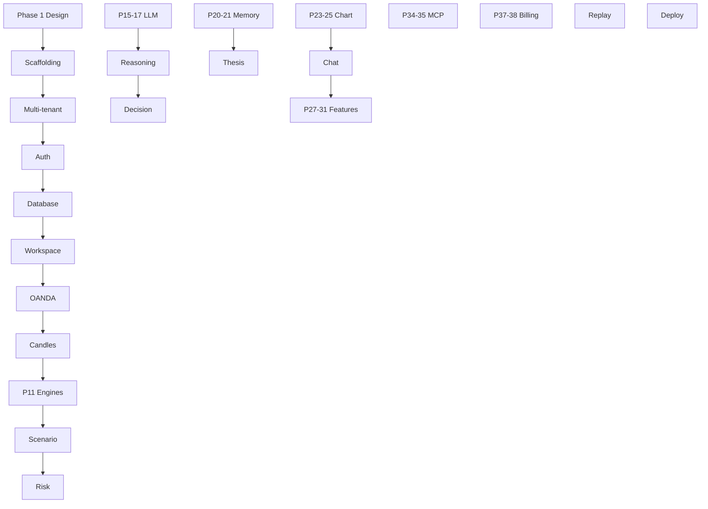

# Leovee — Implementation Plan

**Phases:** 43 (per product specification §113)  
**Rule:** Each phase completes to **production quality** — tests, lint, types, tenant isolation, security — before proceeding (§114).  
**Prerequisite:** Design documents (Phase 1) approved — this repository contains Phase 1 deliverables.

---

## 1. Dependency overview

---

## 2. Phase definitions

### Phase 1 — Design documents ✅

**Deliverables:** `ARCHITECTURE.md`, `DATABASE_SCHEMA.md`, `AGENT_ARCHITECTURE.md`, `MEMORY_ARCHITECTURE.md`, `MCP_ARCHITECTURE.md`, `SAAS_ARCHITECTURE.md`, `DEPLOYMENT.md`, `IMPLEMENTATION_PLAN.md`.

**Exit criteria:** Internal consistency review; ADRs recorded in ARCHITECTURE.md.

---

### Phase 2 — Project scaffolding + CI + Docker

**Scope:**

- Monorepo: `backend/`, `frontend/`, `docker/`, `.github/workflows/ci.yml`
- `pyproject.toml` (ruff, mypy, pytest), `frontend` Vite + TS strict + Tailwind
- Pin `klinecharts@9.8.12` in frontend `package.json`
- Dockerfiles + `docker-compose.yml` + `.env.example`
- Placeholder health routes

**Tests:** CI runs (may be minimal pass).

**Exit:** `docker compose up` starts postgres, redis, api shell, web shell.

---

### Phase 3 — Multi-tenant foundation

**Scope:**

- SQLAlchemy models: `organizations`, `users`, `organization_members`
- `TenantContext` dependency; never trust client tenant_id
- Base model mixins: `tenant_id`, timestamps

**Tests:** Unit tests for context resolution.

---

### Phase 4 — Authentication

**Scope:**

- Email/password signup, verification, login, refresh, logout, password reset
- Argon2 hashing, sessions table, JWT
- Rate limits on auth routes
- Resend email adapter (sandbox in dev)

**Tests:** Auth flow integration; rate limit; session revocation.

---

### Phase 5 — Database + migrations (incl. pgvector)

**Scope:**

- Alembic init; extensions migration
- Core identity tables from `DATABASE_SCHEMA.md`
- App DB role + RLS migration skeleton

**Tests:** Migration up/down on clean DB.

---

### Phase 6 — Workspace system

**Scope:**

- Workspaces, workspace_members, roles/permissions seed
- Default workspace on signup
- REST: `/api/v1/workspaces`, settings JSON schema

**Tests:** Tenant isolation — user A ≠ user B workspace.

---

### Phase 7 — OANDA integration (REST + streaming + backfill)

**Scope:**

- `MarketDataProvider` interface
- `OandaMarketDataProvider` REST: instruments, candles, pricing
- Stream consumer with reconnect, backoff, connection limits
- Gap backfill via REST

**Tests:** Mock OANDA; reconnect backfill idempotency.

---

### Phase 8 — Market data normalization + candle storage/retention

**Scope:**

- Normalized `Candle` model; partitioned `candles` table
- Upsert ingest; retention jobs
- REST `/api/v1/markets/*`

**Tests:** Duplicate/out-of-order upsert; retention job.

---

### Phase 9 — Market intelligence

**Scope:** `MarketIntelligenceEngine` — trend, range, momentum, exhaustion (deterministic).

**Tests:** Golden fixtures on synthetic OHLC.

---

### Phase 10 — Multi-timeframe engine

**Scope:** HTF/MTF/LTF bias pipeline; configurable stacks.

**Tests:** Bias alignment scenarios.

---

### Phase 11 — Structure / liquidity / zones / volatility engines

**Scope:** Four engines + persistence to `market_events`, structures, zones tables.

**Tests:** Unit per engine; sweep vs target; zone decay.

---

### Phase 12 — Scenario engine

**Scope:** Bull/bear/no-trade scenario objects; links to agent run.

**Tests:** Always three base scenarios present.

---

### Phase 13 — Risk engine

**Scope:** Deterministic risk, position size, spread impact, vol-adjusted stops.

**Tests:** Pip math; failure → NO_TRADE path.

---

### Phase 14 — News/calendar providers + research agent

**Scope:** Finnhub adapters; `ResearchAgent`; `news_events` ingestion worker.

**Tests:** Mock API; provenance fields required.

---

### Phase 15 — Anthropic integration

**Scope:** `AnthropicProvider` implementing `LLMProvider`.

**Tests:** Mock SDK; retry/timeout normalization.

---

### Phase 16 — OpenAI integration

**Scope:** `OpenAIProvider`; streaming + tool calls.

**Tests:** Mock SDK parity with interface.

---

### Phase 17 — Model router

**Scope:** `ModelRouter`, `model_configs` admin seed, task routing.

**Tests:** Fallback when primary fails.

---

### Phase 18 — Reasoning + adversarial validation

**Scope:** `ReasoningEngine`, `DevilsAdvocateAgent`, structured outputs.

**Tests:** Adversarial fail blocks READY.

---

### Phase 19 — Decision engine

**Scope:** BUY/SELL/WAIT/NO_TRADE; decay flag respect.

**Tests:** Strategy suspended → no READY.

---

### Phase 20 — Memory foundation

**Scope:** Episodes, embeddings worker, hybrid retrieval, memory tools (read).

**Tests:** Workspace isolation; vector search filters.

---

### Phase 21 — Learning pipeline

**Scope:** OutcomeRecorder, stats, calibration bins, MemoryWriter, decay detector.

**Tests:** Calibration math; LOW_SAMPLE; no LLM in outcome facts.

---

### Phase 22 — Thesis system + monitoring

**Scope:** Thesis CRUD, state machine, monitor worker, events.

**Tests:** INVALIDATED on structure break fixture.

---

### Phase 23 — Chart semantic engine

**Scope:** `ChartSemanticModel`, validation, API persistence.

**Tests:** Time/price only geometry; lifecycle states.

---

### Phase 24 — KLineChart integration

**Scope:** `frontend/src/chart/*` ChartEngine + KLineChart 9.8.12 adapter; normalized candles.

**Tests:** Adapter unit tests; TF switch.

---

### Phase 25 — Chart renderer and annotation system

**Scope:** Annotation renderer, versioning, WS updates.

**Tests:** Incremental update; no full rebuild on tick.

---

### Phase 26 — Chat system (with RECALL)

**Scope:** Conversations, messages, streaming, context management, modes, actions.

**Tests:** RECALL injected; summarized history.

---

### Phase 27 — Recommendations

**Scope:** Full recommendation lifecycle API + UI cards.

**Tests:** State transitions; terminal → outcome event.

---

### Phase 28 — Trades

**Scope:** Trade entities, ideas, optional execution hooks behind flag.

**Tests:** Execution safety gates.

---

### Phase 29 — Watchlists

**Scope:** Multiple watchlists; real-time fields on WS.

**Tests:** CRUD isolation.

---

### Phase 30 — Alerts

**Scope:** Alert rules, triggers, notification fan-out.

**Tests:** Price alert trigger mock.

---

### Phase 31 — Journal

**Scope:** Journal entries; promote to lesson action.

**Tests:** Promotion creates lesson proposal flow.

---

### Phase 32 — Memory UI section

**Scope:** Browse/edit/delete memories; calibration chart.

**Tests:** E2E delete triggers recompute job.

---

### Phase 33 — Performance

**Scope:** Metrics dashboard including calibration curve.

**Tests:** Stats match DB aggregates.

---

### Phase 34 — MCP server

**Scope:** `leovee-mcp` tools calling services; auth; usage.

**Tests:** Workspace escape; audit log entry.

---

### Phase 35 — MCP Apps

**Scope:** ext-apps manifests; chart + recommendation apps.

**Tests:** CSP; API auth from app bridge.

---

### Phase 36 — Admin dashboard

**Scope:** All 28 admin sections (iterative UI); agent/memory observability.

**Tests:** Permission boundaries; support cannot read chat by default.

---

### Phase 37 — Billing + payments

**Scope:** Stripe + manual invoice; plans; webhooks.

**Tests:** Webhook idempotency; entitlement update.

---

### Phase 38 — Usage limits + entitlements

**Scope:** `UsageService` integration on LLM, analysis, MCP.

**Tests:** Hard limit blocks request.

---

### Phase 39 — Observability

**Scope:** Metrics endpoint, Sentry abstraction, structured logging fields.

**Tests:** Request ID propagation to worker.

---

### Phase 40 — Security hardening

**Scope:** RLS enforcement, CSP, security headers, API key scopes, penetration fixes.

**Tests:** Full multi-tenant suite §100.

---

### Phase 41 — Replay/backtesting

**Scope:** `HistoricalReplayEngine`; UI replay; memory temporal isolation.

**Tests:** No future leakage §101.

---

### Phase 42 — Deployment assets + production testing

**Scope:** Finalize DEPLOYMENT.md assets; staging deploy; load smoke.

**Tests:** Health checks; migrate job; backup script dry run.

---

### Phase 43 — Launch readiness review

**Scope:** Checklist in DEPLOYMENT.md §17; documentation pass; runbook.

**Exit:** Sign-off for production launch.

---

## 3. Cross-cutting requirements (every phase)

Per spec §114:

1. Run tests  
2. Run type checks (`mypy`, `tsc`)  
3. Run lint (`ruff`, `eslint`)  
4. Verify tenant isolation (when data touched)  
5. Verify API contracts  
6. Verify security  
7. Document changes in phase PR description  

**Chart phases (24–25):** KLineChart integration checklist §114.  
**Memory phases (20–21, 32):** Memory checklist §114.

---

## 4. Suggested team parallelization

After Phase 8, parallel tracks merge frequently:

| Track A | Track B | Track C |
|---------|---------|---------|
| Engines 9–13 | LLM 15–19 | Frontend shell + chart 24–25 |
| Memory 20–21 | Thesis 22 | Chat 26 |
| MCP 34–35 | Billing 37–38 | Admin 36 |

Integration milestones: end of Phase 19 (decision), 26 (chat E2E), 42 (deploy).

---

## 5. Package & naming conventions

| Artifact | Name |
|----------|------|
| Python package | `leovee` (`backend/app`) |
| PyPI / CLI MCP | `leovee-mcp` |
| Frontend package | `@leovee/web` |
| Chart library internal | `@leovee/chart` |
| Docker images | `ghcr.io/<org>/leovee-api`, `leovee-web` |

---

## 6. Risk register (implementation)

| Risk | Mitigation |
|------|------------|
| OANDA rate/connection limits | Dedicated stream service; symbol prioritization |
| LLM cost overrun | ModelRouter + event-driven triggers + usage caps |
| pgvector scale | Partition embeddings; HNSW tuning; archival |
| KLineChart API drift | Pinned 9.8.12; adapter isolation |
| Scope creep | Strict phase gates; spec as source of truth |

---

## 7. Current status

| Phase | Status |
|-------|--------|
| 1 | **Complete** — design documents in repo root |
| 3 | **Complete** — organizations, users, TenantContext |
| 4–43 | Not started |

**Next action after approval:** Begin Phase 2 on branch `cursor/scaffolding-phase-2-199e` (or continuation branch).

---

## 8. Document map

| File | Purpose |
|------|---------|
| `LEOVEE_SPEC.md` | Full product specification (source) |
| `ARCHITECTURE.md` | System stack and boundaries |
| `DATABASE_SCHEMA.md` | Persistence |
| `AGENT_ARCHITECTURE.md` | Agent layers and loop |
| `MEMORY_ARCHITECTURE.md` | Learning and retrieval |
| `MCP_ARCHITECTURE.md` | leovee-mcp |
| `SAAS_ARCHITECTURE.md` | Tenancy, auth, billing |
| `DEPLOYMENT.md` | Ops and CI/CD |
| `IMPLEMENTATION_PLAN.md` | This phased plan |
