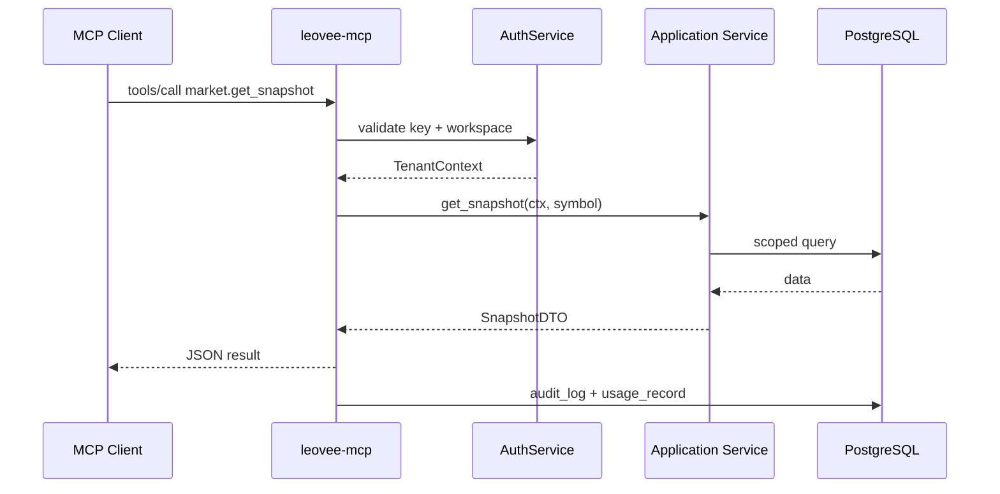

# Leovee — MCP Architecture

**Server name:** `leovee-mcp`  
**Foundation:** [Model Context Protocol](https://modelcontextprotocol.io) with [ext-apps](https://github.com/modelcontextprotocol/ext-apps) patterns for MCP App-compatible experiences.  
**Principle:** MCP is a **thin protocol adapter** over Leovee application services — no duplicated business logic.

---

## 1. Goals

1. Expose workspace-scoped trading analysis capabilities to external AI clients (Cursor, Claude Desktop, custom agents).
2. Enforce **identical** authentication, authorization, tenant isolation, rate limits, and audit as REST.
3. Support **MCP Apps** that render charts (KLineChart-powered UIs), recommendations, thesis state, and memory insights using the same backend APIs.
4. Never leak secrets (OANDA tokens, DB credentials, raw API keys).

---

## 2. Deployment topology

```
┌─────────────────┐     stdio / SSE / HTTP      ┌──────────────────┐
│ MCP Client      │ ◄────────────────────────► │ leovee-mcp       │
│ (e.g. IDE)      │                             │ (Python process) │
└─────────────────┘                             └────────┬─────────┘
                                                         │
                                                         │ internal HTTP
                                                         ▼
                                                ┌──────────────────┐
                                                │ FastAPI services │
                                                │ (same codebase)  │
                                                └──────────────────┘
```

**Modes:**

| Transport | Use case |
|-----------|----------|
| stdio | Local IDE integration |
| SSE / Streamable HTTP | Remote hosted MCP |
| Sidecar container | Production (see `DEPLOYMENT.md`) |

The MCP server shares `backend/app/services/*` via in-process imports when colocated, or authenticated internal API when split.

---

## 3. Authentication & session

### 3.1 Credentials

Clients authenticate with **Leovee API keys** (scoped) or **OAuth bearer tokens** obtained through the standard auth flow.

| Method | Header / param |
|--------|----------------|
| API key | `Authorization: Bearer lvk_...` |
| User OAuth | `Authorization: Bearer <access_token>` |

### 3.2 Workspace binding

Every MCP session is bound to exactly one `workspace_id`:

- Resolved from API key record, or
- From token claims + `X-Workspace-Id` header (validated against membership).

**Reject** if client supplies a workspace they do not belong to.

### 3.3 `mcp_sessions` table

Track: `id`, `workspace_id`, `user_id`, `client_info`, `started_at`, `last_seen_at`, `revoked_at` for admin observability (spec §76).

### 3.4 Rate limits

Redis sliding window per `(api_key_id | user_id, tool_name)`:

- Default: plan-based MCP call limits from `UsageService`.
- Burst allowance configurable in admin.

---

## 4. Authorization

Map MCP tool invocations to existing RBAC permissions:

| Tool prefix | Permission |
|-------------|------------|
| `market.*` | `market.read` or workspace read |
| `analysis.*` | `analysis.read` / `analysis.write` |
| `memory.*` | `memory.read` |
| `workspace.*` | `workspace.read` |
| Admin tools | **Not exposed** via user MCP |

`SUPER_ADMIN` MCP tools are disabled in standard server build; admin uses separate internal tooling.

---

## 5. Tool catalog

Tools call application services; return JSON-serializable, schema-versioned payloads.

### 5.1 Market

| Tool | Description | Service |
|------|-------------|---------|
| `market.get_snapshot` | Bid/ask/spread/mid | `MarketDataService` |
| `market.get_candles` | OHLC series | `MarketDataService` |
| `market.get_price` | Latest price | `MarketDataService` |
| `market.get_multi_timeframe` | Bundled TFs | `MarketDataService` |

### 5.2 Analysis

| Tool | Description |
|------|-------------|
| `analysis.run` | Start agent run (async job id returned) |
| `analysis.get` | Fetch analysis by id |
| `analysis.explain` | Rationale + evidence for existing analysis |

### 5.3 Research

| Tool | Description |
|------|-------------|
| `research.search` | News + calendar ranked |
| `research.get` | Stored research item |

### 5.4 Recommendations & thesis

| Tool | Description |
|------|-------------|
| `recommendation.get` | Single recommendation |
| `recommendation.list` | Filtered list |
| `thesis.get` | Active thesis |
| `thesis.validate` | Deterministic validation status |

### 5.5 Chart

| Tool | Description |
|------|-------------|
| `chart.get_annotations` | Semantic annotations (not KLineChart ops) |
| `chart.get_analysis` | Analysis + chart version |

### 5.6 Memory

| Tool | Description |
|------|-------------|
| `memory.search` | Hybrid search |
| `memory.get_symbol_profile` | Symbol knowledge |
| `memory.get_strategy_stats` | Strategy stats |
| `memory.get_lessons` | Lessons list |

### 5.7 Workspace

| Tool | Description |
|------|-------------|
| `workspace.get` | Metadata |
| `workspace.context` | Preferences + active symbol context |
| `watchlist.get` | Watchlists |

### 5.8 Write restrictions

- No MCP tool for raw order placement unless `OANDA_EXECUTION` flag + scope `trade.execute` (future).
- No `memory.propose_lesson` via MCP for untrusted clients unless scope `memory.manage` (optional).

---

## 6. Resources (optional MCP resources)

Expose read-only URIs for clients that support MCP resources:

- `leovee://workspace/{id}/watchlist`
- `leovee://recommendation/{id}`
- `leovee://thesis/{id}`

Content-Type: `application/json`.

---

## 7. MCP Apps (ext-apps)

### 7.1 Architecture

MCP Apps are **hosted UI bundles** that:

1. Receive context from the host (workspace, symbol, analysis id).
2. Call **the same** Leovee REST API with the user's token (CORS allowlist).
3. Render using shared React components where possible (chart package published as `@leovee/chart` internal package).

### 7.2 App types

| App | UI content |
|-----|------------|
| `leovee-chart-app` | KLineChart via ChartEngine, annotations from API |
| `leovee-recommendation-app` | Recommendation card + thesis |
| `leovee-research-app` | News/calendar evidence |
| `leovee-memory-app` | Lessons + stats summary |

### 7.3 Chart in MCP Apps

- App fetches `chart.get_annotations` + candles REST endpoint.
- **KLineChart 9.8.12** only inside chart package — same adapter as main web app.
- No MCP tool returns KLineChart-specific draw commands.

### 7.4 Security

- Apps run in sandboxed iframe per ext-apps host rules.
- CSP restricts script origins to Leovee CDN.
- Tokens passed via host bridge — not in URL query strings.

---

## 8. Request flow



---

## 9. Audit & usage

Every tool call:

1. `audit_logs` — `action=MCP_TOOL_CALL`, `metadata={tool, duration_ms}`.
2. `usage_records` — increment `mcp_calls` metric.
3. Optional trace id linked to `agent_runs` when `analysis.run` invoked.

---

## 10. Error model

Normalized errors (same as REST):

| Code | Meaning |
|------|---------|
| `UNAUTHORIZED` | Invalid/expired token |
| `FORBIDDEN` | Missing scope |
| `NOT_FOUND` | Resource outside workspace |
| `RATE_LIMITED` | Plan limit |
| `DATA_UNAVAILABLE` | OANDA down |
| `FEATURE_DISABLED` | MCP flag off |

Never include stack traces or secrets in client-visible errors.

---

## 11. Package layout

```
backend/app/mcp/
  server.py           # Entry: stdio / SSE
  auth.py             # Token + workspace resolution
  tools/
    market.py
    analysis.py
    research.py
    recommendation.py
    thesis.py
    chart.py
    memory.py
    workspace.py
  resources.py
  apps/               # MCP App manifest metadata
    chart-app.json
    ...
```

CLI entry point: `leovee-mcp` in `pyproject.toml`.

---

## 12. Testing

| Test | Description |
|------|-------------|
| Workspace escape | Key for WS-A cannot read WS-B recommendation |
| Scope enforcement | `memory.read` without `analysis.write` blocks `analysis.run` |
| Usage metering | Calls increment usage_records |
| Parity | MCP `market.get_candles` matches REST payload hash |

---

## 13. Versioning

- MCP server version aligned with API `v1`.
- Tool schemas versioned with `schema_version` field in responses.
- Breaking tool changes require new tool names (e.g. `market.get_candles_v2`).
