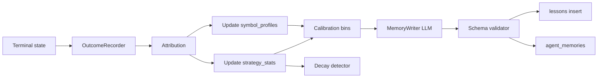

# Leovee — Memory & Learning Architecture

**Status:** Core subsystem — first-class product surface and agent layer (L14).  
**Storage:** PostgreSQL + **pgvector**; Redis for retrieval cache only (not source of truth).  
**Companion:** `AGENT_ARCHITECTURE.md`, `DATABASE_SCHEMA.md`, `SAAS_ARCHITECTURE.md`.

---

## 1. Purpose

Leovee must **remember** analyses, recommendations, theses, and outcomes, and **learn** from them without replacing live market data. Memory informs decisions as **labeled historical evidence** with provenance, sample sizes, and calibrated confidence.

Non-goals:

- Cross-tenant learning (default **off**; see §10).
- Storing secrets, credentials, or PII in market memory tables.
- LLM-direct writes to durable memory without schema validation.

---

## 2. Memory types

### 2.1 Episodic memory

**What:** Immutable-ish records of agent runs and terminal outcomes.

**Table:** `agent_episodes` (+ link to `agent_runs`, `recommendations`, `theses`).

**Schema (logical `content` / `evidence_snapshot_json`):**

```json
{
  "episode_id": "uuid",
  "workspace_id": "uuid",
  "symbol": "EURUSD",
  "timeframes": ["H4", "H1", "M15", "M5"],
  "market_regime": "TREND_UP",
  "session": "LONDON",
  "volatility_bucket": "NORMAL",
  "setup_type": "PULLBACK_CONTINUATION",
  "strategy_code": "MTF_STRUCTURE",
  "decision": "BUY",
  "confidence_stated_calibrated": 0.62,
  "entry": 1.0850,
  "stop": 1.0820,
  "targets": [1.0900, 1.0920],
  "outcome": "INVALIDATED",
  "r_achieved": -1.0,
  "evidence_refs": [
    {"type": "market_structure", "source": "MarketStructureEngine", "timeframe": "M15", "id": "..."}
  ],
  "occurred_at": "2026-08-01T12:00:00Z",
  "source": "LIVE"
}
```

**Retention:** Configurable per plan (`memory_retention_days`); archival moves old episodes to cold storage tables (same schema, read-only).

### 2.2 Semantic memory (symbol knowledge)

**What:** Distilled beliefs about a symbol for a workspace.

**Table:** `symbol_profiles.profile_json` + optional `agent_memories` rows type `SEMANTIC`.

**Example entries:**

| Key | Example value | Metadata |
|-----|---------------|----------|
| `session_behavior.LONDON` | "Tends to respect prior day high as liquidity" | n=45, confidence=0.7 |
| `spread_profile.ASIA` | "Avg spread 0.8 pips" | n=120 |
| `breakout_reliability` | "False breakout rate 58% in LOW vol" | n=22, LOW_SAMPLE if n<20 |

Each field: `sample_size`, `confidence`, `last_updated`, `derived_from_episode_ids[]`.

### 2.3 Strategy / procedural memory

**What:** Performance statistics per strategy, setup type, and buckets.

**Table:** `strategy_stats`.

**Dimensions:**

- `workspace_id` (required)
- `symbol_id` (optional — symbol-specific vs workspace-wide)
- `strategy_code`, `setup_type`
- `regime_bucket`, `session_bucket`, `volatility_bucket`

**Metrics:** `occurrences`, `wins`, `losses`, `avg_r`, `profit_factor`, `expectancy`, rolling windows (30/90/365) stored in `metadata_json` or materialized columns.

### 2.4 Lesson memory

**What:** Human-readable, structured lessons from failures/successes.

**Table:** `lessons`.

```json
{
  "statement": "EURUSD false breakouts above PDH common when volatility LOW and no London momentum",
  "conditions": {
    "symbol": "EURUSD",
    "volatility_bucket": "LOW",
    "session": "LONDON_OPEN",
    "setup_type": "BREAKOUT"
  },
  "confidence": 0.65,
  "supporting_episode_ids": ["uuid", "..."],
  "created_at": "...",
  "decay_at": "...",
  "user_edited": false
}
```

Creation path: **MemoryWriter proposes** → validator → insert. Users may edit/delete (triggers recompute — §9).

### 2.5 Workspace / user memory

**What:** Preferences, corrections, feedback — not market facts.

**Table:** `agent_memories` type `USER` or keys in `workspaces.settings_json` for static prefs.

Examples: preferred timeframes, risk %, "don't suggest trades before NY open", thumbs up/down on recommendations, rejected trade ideas.

**Isolation:** Strictly `workspace_id`; never merged into other workspaces.

### 2.6 Conversation memory

**What:** Rolling summaries per conversation.

**Table:** `conversations.summary_text`, updated by background job when token count exceeds threshold.

**Policy:** Summarize messages older than last N turns; preserve symbol/thesis references and user corrections.

---

## 3. Learning pipeline

Triggered on **terminal** recommendation/thesis/trade states: `TARGET_REACHED`, `INVALIDATED`, `EXPIRED`, `CLOSED`, `NO_TRADE` (when configured as terminal for learning).



### 3.1 OutcomeRecorder (deterministic — no LLM)

- Reads final prices, thesis invalidation rules, and time bounds from DB — not from model text.
- Writes `outcome_records` + updates `trade_outcomes`.
- Computes `r_multiple` from defined entry/stop/target rules (documented formulas in code).
- Emits `OUTCOME_RECORDED` event.

### 3.2 Attribution

Maps outcome to:

- `strategy_code`, `setup_type`
- `regime_bucket`, `session_bucket`, `volatility_bucket` at entry time (from stored snapshot on recommendation)

### 3.3 Statistics update

Incremental update of `strategy_stats` (Welford or batch recompute for corrections).  
**Replay** outcomes update `strategy_stats_replay` shadow tables or `source=REPLAY` filtered aggregates — **never mix** with LIVE dashboards unless admin enables comparison view.

### 3.4 Confidence calibration

**Raw confidence** from scenario engine is transformed for display and decision thresholds.

**Method:** Per-workspace (optional per-strategy) **reliability bins**:

- Bin stated confidence into buckets [0,0.1), …, [0.9,1.0].
- Track `predicted_count` and `realized_success_count` (success defined: target hit before invalidation for directional trades; configurable for WAIT/NO_TRADE).

**Calibrated value:** For stated confidence `p`, use historical accuracy `a(b)` of bin containing `p`, blended with prior:

`p_cal = (n * a(b) + n_prior * p_prior) / (n + n_prior)`

Defaults: `n_prior = 20`, `p_prior = 0.5` until data exists.

Store bins in `calibration_bins`; expose **calibration curve** in Performance UI.

**Decision engine** uses `p_cal` for READY gating (minimum threshold configurable).

### 3.5 MemoryWriter (LLM-assisted)

- Input: outcome record, episode snapshot, adversarial objections, what happened vs plan.
- Output: `LessonProposal[]`, optional `SemanticUpdateProposal[]`.
- Rules: must cite `episode_id`s; no new prices; mark `LOW_SAMPLE` if supporting n < threshold.

### 3.6 Strategy decay detection

Compare rolling live metrics (e.g. last 30 trades) vs historical expectancy:

- If `|live_avg_r - hist_avg_r| > threshold` AND `live_n >= min_n` → flag `STRATEGY_DECAY_DETECTED`.
- Auto-suspend strategy for new READY recommendations (configurable); admin/user can unsuspend.

---

## 4. Retrieval (RECALL)

Hybrid retrieval runs **before** HYPOTHESIZE / REASONING in analyze flows.

### 4.1 Retrieval channels

| Channel | Mechanism | Use |
|---------|-----------|-----|
| Structured | SQL filters on symbol, setup, regime, session | Exact stats, lessons |
| Vector | pgvector cosine on episode/lesson embeddings | Similar setups |
| Recency | Time decay weight | Recent episodes |
| Relevance | Cross-encoder or LLM rerank (optional, budgeted) | Top-k refinement |

### 4.2 Embedding pipeline

- Model: configurable (`text-embedding-3-small` class default).
- Source text: canonical JSON summary of episode (not raw chat).
- Async worker writes `memory_embeddings` after episode commit.
- Re-embed on lesson edit.

### 4.3 Retrieval budget (token limits)

Default budgets (configurable in admin):

| Category | Token budget |
|----------|----------------|
| Symbol profile | 800 |
| Strategy stats | 600 |
| Lessons | 1200 |
| Similar episodes | 1500 |
| User prefs | 400 |

Assembler packs highest **score** items until budget exhausted.

**Scoring (illustrative):**

`score = w_sim * cosine_sim + w_recency * exp(-λ * age_days) + w_conf * confidence`

Lessons past `decay_at` get reduced `w_recency`; archived excluded.

### 4.4 Presentation to LLM

Wrapped in a single block:

```
=== HISTORICAL MEMORY (not current market data) ===
[SEMANTIC] EURUSD London: ... (n=45, confidence=0.7, episodes: e1,e2)
[LESSON] ... (LOW_SAMPLE: false)
[STATS] MTF_STRUCTURE / PULLBACK: win_rate=0.52, n=38, avg_r=0.4
=== END HISTORICAL MEMORY ===
```

Live data always appended in separate `=== LIVE DATA ===` block.

---

## 5. Guardrails

| Rule | Enforcement |
|------|-------------|
| Live data overrides memory | Orchestrator injects LIVE block after RECALL; system prompt |
| Minimum sample size | `low_sample` flag when n < `memory.min_sample` (default 20) |
| Aging | `freshness_score` decays; lessons archive after `decay_at` |
| Regime bucketing | Stats keyed by regime/session/vol buckets — no global blur |
| Tenant isolation | All queries filter `workspace_id`; RLS on memory tables |
| No cross-workspace leakage | Integration tests + RLS |
| Validated writes | Pydantic models for all inserts; `memory.propose_lesson` → queue → validator |
| No secrets in memory | Content scanner rejects API-key patterns |
| User deletion | Cascade recompute job for stats/calibration |

### 5.1 Degraded mode

If pgvector or retrieval fails:

- Log error; continue analysis with LIVE data only.
- User message tag: `memory_status: DEGRADED`.
- Never fabricate memories.

---

## 6. Decay and aging

### 6.1 Lesson decay

- On create: `decay_at = now + lesson_ttl_days` (default 180).
- Nightly job: reduce `freshness_score`; archive when score < threshold or past `decay_at`.

### 6.2 Semantic memory

- Recomputed from rolling window of episodes (e.g. last 365 days) on outcome and weekly refresh.
- Old regimes fade via exponential weighting.

### 6.3 User corrections

- User edits lesson → `user_edited=true`, freeze from auto-overwrite unless new episodes contradict (admin flag).

---

## 7. Replay temporal isolation

For replay at time `T_replay`:

```sql
-- Episodic recall constraint
occurred_at <= T_replay AND source IN ('LIVE', 'REPLAY')
-- Lessons
created_at <= T_replay
-- Stats materialized view
as_of <= T_replay  -- snapshot per replay job
```

Vector search filtered by same predicates **before** top-k.

KLineChart replay UI hides candles with `ts > T_replay`.

Learning from replay writes `source=REPLAY` and does not update LIVE calibration bins (separate bin set or excluded).

---

## 8. User-facing Memory UI

**Route:** `/memory` (sidebar §16.5).

| Tab | Data source |
|-----|-------------|
| Symbol profiles | `symbol_profiles` |
| Strategy statistics | `strategy_stats` |
| Lessons | `lessons` |
| Calibration | `calibration_bins` + chart |
| Recent episodes | `agent_episodes` |

**Actions:**

- Search (full-text + filters)
- View episode detail with evidence refs
- Edit lesson text/conditions (triggers audit + optional re-embed)
- Delete lesson/episode → enqueue **recompute_statistics(workspace_id)**

Chat: "What have you learned about EURUSD?" → RECALL + citation links to episode IDs in UI.

---

## 9. Recomputation on delete/edit

Job `memory.recompute_workspace`:

1. Lock workspace memory version.
2. Rebuild `strategy_stats` from episodes.
3. Rebuild `symbol_profiles` aggregates.
4. Recalculate `calibration_bins`.
5. Invalidate retrieval cache keys `mem:ws:{id}:*`.

---

## 10. Platform aggregate learning (feature flag)

`CROSS_TENANT_AGGREGATE_LEARNING` default **OFF**.

When enabled by super-admin:

- Only **anonymized** aggregates (no workspace id in export).
- Minimum k-anonymity threshold per bucket.
- No raw episode text cross-tenant.

---

## 11. API surface (memory)

REST under `/api/v1/memory`:

- `GET /profiles/{symbol}`
- `GET /strategies/stats`
- `GET /lessons`
- `GET /episodes`
- `GET /calibration`
- `PATCH /lessons/{id}`
- `DELETE /lessons/{id}`, `DELETE /episodes/{id}`

All require `memory.read` / `memory.manage` permissions.

---

## 12. MCP tools (memory)

- `memory.search`
- `memory.get_symbol_profile`
- `memory.get_strategy_stats`
- `memory.get_lessons`

Same isolation and audit as REST.

---

## 13. Observability

Metrics:

- `memory_retrieval_latency_ms`
- `memory_retrieval_count` by type
- `episodes_written_total`
- `lessons_created_total`
- `learning_pipeline_lag_seconds`
- `embedding_queue_depth`

Admin panel §77: store growth, decay flags, calibration accuracy over time.

---

## 14. Configuration (admin)

| Parameter | Default |
|-----------|---------|
| `memory.min_sample` | 20 |
| `memory.lesson_ttl_days` | 180 |
| `memory.retrieval_budget_tokens` | 4500 |
| `memory.embedding_model` | from model_configs |
| `calibration.n_prior` | 20 |
| `decay.rolling_window_trades` | 30 |
| `decay.threshold_avg_r_delta` | 0.5 |

---

## 15. Testing requirements

| Test | Assertion |
|------|-----------|
| Tenant isolation | User A cannot read B episodes |
| LOW_SAMPLE | n=5 stats labeled, not used for READY gate |
| Calibration | Bin updates shift p_cal correctly |
| OutcomeRecorder | LLM output ignored for R calculation |
| Replay recall | Episode at T+1 day not visible at replay T |
| Delete episode | Stats decrease occurrence count |
| Degraded retrieval | Analysis succeeds without memory block |

---

## 16. Data flow summary

```
        ┌─────────────┐
        │ Agent Run   │
        └──────┬──────┘
               │ complete
               ▼
        ┌─────────────┐     terminal     ┌────────────────┐
        │ Episode     │ ───────────────► │ OutcomeRecorder │
        └─────────────┘                  └────────┬───────┘
               ▲                                  │
               │ RECALL                           ▼
        ┌──────┴──────┐                  ┌────────────────┐
        │ Retrieval   │ ◄── embeddings │ Learning jobs   │
        └─────────────┘                  └────────────────┘
```

Memory **informs**; live OANDA data **decides** current market truth.
